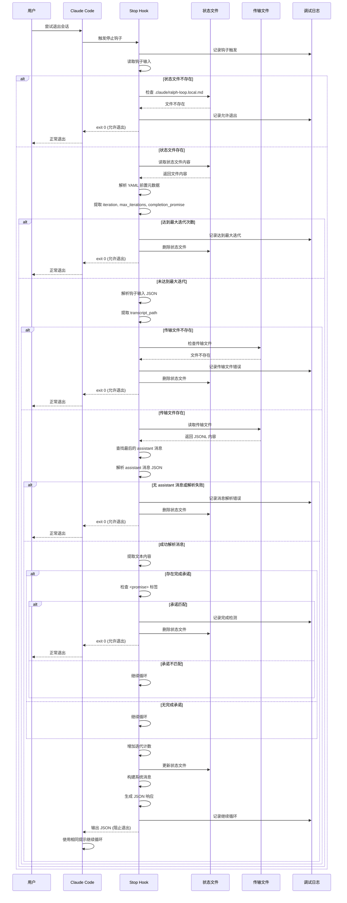
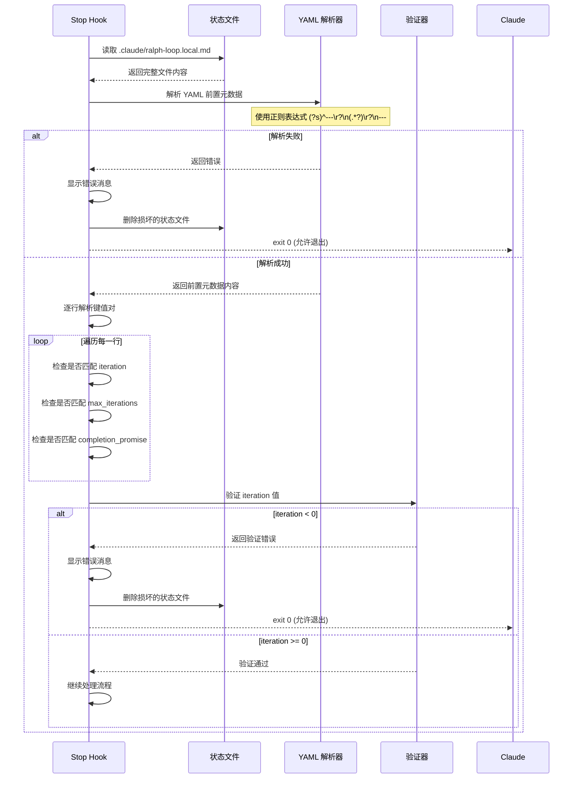
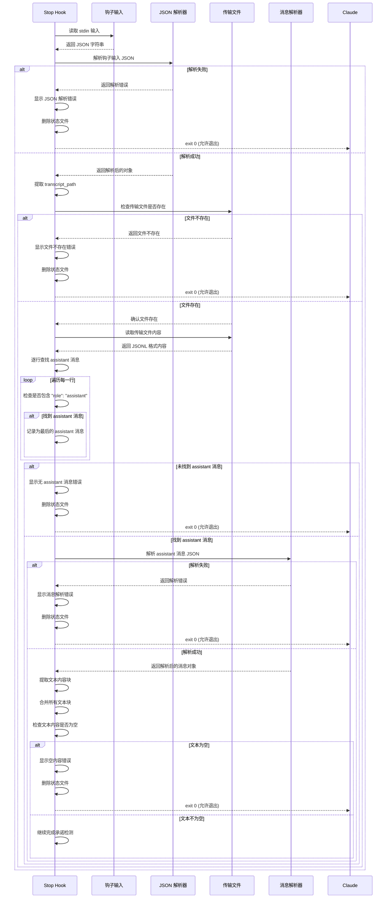
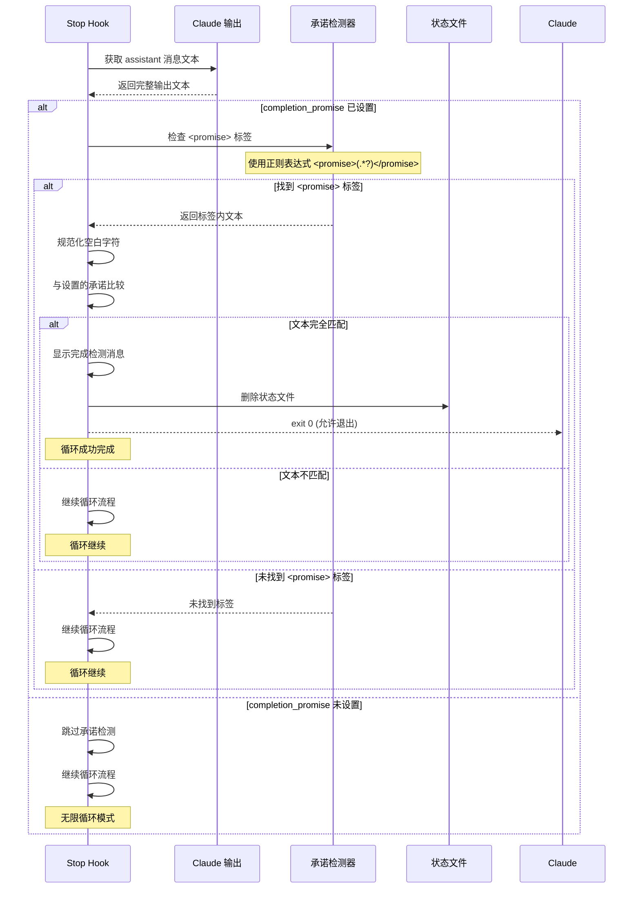
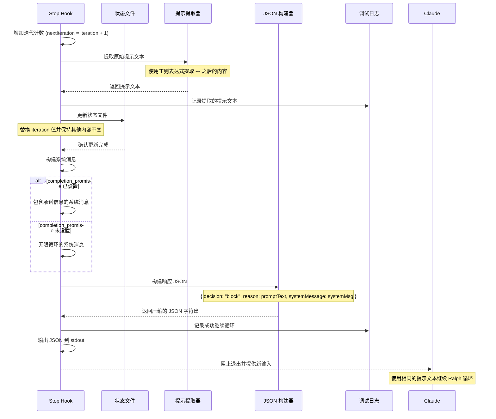
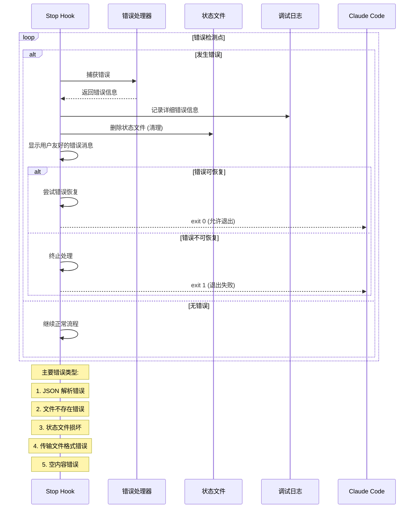

# Ralph Wiggum Stop Hook 时序图

## 整体流程时序图

```mermaid
sequenceDiagram
    participant User as 用户
    participant Claude as Claude Code
    participant Hook as Stop Hook
    participant State as 状态文件
    participant Transcript as 传输文件
    participant Log as 调试日志

    User->>Claude: 尝试退出会话
    Claude->>Hook: 触发停止钩子
    Hook->>Log: 记录钩子触发
    Hook->>Hook: 读取钩子输入
    
    alt 状态文件不存在
        Hook->>State: 检查 .claude/ralph-loop.local.md
        State-->>Hook: 文件不存在
        Hook->>Log: 记录允许退出
        Hook-->>Claude: exit 0 (允许退出)
        Claude-->>User: 正常退出
    else 状态文件存在
        Hook->>State: 读取状态文件内容
        State-->>Hook: 返回文件内容
        Hook->>Hook: 解析 YAML 前置元数据
        Hook->>Hook: 提取 iteration, max_iterations, completion_promise
        
        alt 达到最大迭代次数
            Hook->>Log: 记录达到最大迭代
            Hook->>State: 删除状态文件
            Hook-->>Claude: exit 0 (允许退出)
            Claude-->>User: 正常退出
        else 未达到最大迭代
            Hook->>Hook: 解析钩子输入 JSON
            Hook->>Hook: 提取 transcript_path
            
            alt 传输文件不存在
                Hook->>Transcript: 检查传输文件
                Transcript-->>Hook: 文件不存在
                Hook->>Log: 记录传输文件错误
                Hook->>State: 删除状态文件
                Hook-->>Claude: exit 0 (允许退出)
                Claude-->>User: 正常退出
            else 传输文件存在
                Hook->>Transcript: 读取传输文件
                Transcript-->>Hook: 返回 JSONL 内容
                Hook->>Hook: 查找最后的 assistant 消息
                Hook->>Hook: 解析 assistant 消息 JSON
                
                alt 无 assistant 消息或解析失败
                    Hook->>Log: 记录消息解析错误
                    Hook->>State: 删除状态文件
                    Hook-->>Claude: exit 0 (允许退出)
                    Claude-->>User: 正常退出
                else 成功解析消息
                    Hook->>Hook: 提取文本内容
                    
                    alt 存在完成承诺
                        Hook->>Hook: 检查 <promise> 标签
                        alt 承诺匹配
                            Hook->>Log: 记录完成检测
                            Hook->>State: 删除状态文件
                            Hook-->>Claude: exit 0 (允许退出)
                            Claude-->>User: 正常退出
                        else 承诺不匹配
                            Hook->>Hook: 继续循环
                        end
                    else 无完成承诺
                        Hook->>Hook: 继续循环
                    end
                    
                    Hook->>Hook: 增加迭代计数
                    Hook->>State: 更新状态文件
                    Hook->>Hook: 构建系统消息
                    Hook->>Hook: 生成 JSON 响应
                    Hook->>Log: 记录继续循环
                    Hook-->>Claude: 输出 JSON (阻止退出)
                    Claude->>Claude: 使用相同提示继续循环
                end
            end
        end
    end
```

## 状态文件解析时序图

```mermaid
sequenceDiagram
    participant Hook as Stop Hook
    participant State as 状态文件
    participant Parser as YAML 解析器
    participant Validator as 验证器

    Hook->>State: 读取 .claude/ralph-loop.local.md
    State-->>Hook: 返回完整文件内容
    
    Hook->>Parser: 解析 YAML 前置元数据
    Note over Parser: 使用正则表达式 (?s)^---\r?\n(.*?)\r?\n---
    alt 解析失败
        Parser-->>Hook: 返回错误
        Hook->>Hook: 显示错误消息
        Hook->>State: 删除损坏的状态文件
        Hook-->>Claude: exit 0 (允许退出)
    else 解析成功
        Parser-->>Hook: 返回前置元数据内容
        
        Hook->>Hook: 逐行解析键值对
        loop 遍历每一行
            Hook->>Hook: 检查是否匹配 iteration
            Hook->>Hook: 检查是否匹配 max_iterations
            Hook->>Hook: 检查是否匹配 completion_promise
        end
        
        Hook->>Validator: 验证 iteration 值
        alt iteration < 0
            Validator-->>Hook: 返回验证错误
            Hook->>Hook: 显示错误消息
            Hook->>State: 删除损坏的状态文件
            Hook-->>Claude: exit 0 (允许退出)
        else iteration >= 0
            Validator-->>Hook: 验证通过
            Hook->>Hook: 继续处理流程
        end
    end
```

## 传输文件处理时序图

```mermaid
sequenceDiagram
    participant Hook as Stop Hook
    participant Input as 钩子输入
    participant JSONParser as JSON 解析器
    participant Transcript as 传输文件
    participant MessageParser as 消息解析器

    Hook->>Input: 读取 stdin 输入
    Input-->>Hook: 返回 JSON 字符串
    
    Hook->>JSONParser: 解析钩子输入 JSON
    alt 解析失败
        JSONParser-->>Hook: 返回解析错误
        Hook->>Hook: 显示 JSON 解析错误
        Hook->>Hook: 删除状态文件
        Hook-->>Claude: exit 0 (允许退出)
    else 解析成功
        JSONParser-->>Hook: 返回解析后的对象
        Hook->>Hook: 提取 transcript_path
        
        Hook->>Transcript: 检查传输文件是否存在
        alt 文件不存在
            Transcript-->>Hook: 返回文件不存在
            Hook->>Hook: 显示文件不存在错误
            Hook->>Hook: 删除状态文件
            Hook-->>Claude: exit 0 (允许退出)
        else 文件存在
            Transcript-->>Hook: 确认文件存在
            Hook->>Transcript: 读取传输文件内容
            Transcript-->>Hook: 返回 JSONL 格式内容
            
            Hook->>Hook: 逐行查找 assistant 消息
            loop 遍历每一行
                Hook->>Hook: 检查是否包含 "role": "assistant"
                alt 找到 assistant 消息
                    Hook->>Hook: 记录为最后的 assistant 消息
                end
            end
            
            alt 未找到 assistant 消息
                Hook->>Hook: 显示无 assistant 消息错误
                Hook->>Hook: 删除状态文件
                Hook-->>Claude: exit 0 (允许退出)
            else 找到 assistant 消息
                Hook->>MessageParser: 解析 assistant 消息 JSON
                alt 解析失败
                    MessageParser-->>Hook: 返回解析错误
                    Hook->>Hook: 显示消息解析错误
                    Hook->>Hook: 删除状态文件
                    Hook-->>Claude: exit 0 (允许退出)
                else 解析成功
                    MessageParser-->>Hook: 返回解析后的消息对象
                    Hook->>Hook: 提取文本内容块
                    Hook->>Hook: 合并所有文本块
                    Hook->>Hook: 检查文本内容是否为空
                    alt 文本为空
                        Hook->>Hook: 显示空内容错误
                        Hook->>Hook: 删除状态文件
                        Hook-->>Claude: exit 0 (允许退出)
                    else 文本不为空
                        Hook->>Hook: 继续完成承诺检测
                    end
                end
            end
        end
    end
```

## 完成承诺检测时序图

```mermaid
sequenceDiagram
    participant Hook as Stop Hook
    participant Output as Claude 输出
    participant PromiseChecker as 承诺检测器
    participant State as 状态文件

    Hook->>Output: 获取 assistant 消息文本
    Output-->>Hook: 返回完整输出文本
    
    alt completion_promise 已设置
        Hook->>PromiseChecker: 检查 <promise> 标签
        Note over PromiseChecker: 使用正则表达式 <promise>(.*?)</promise>
        alt 找到 <promise> 标签
            PromiseChecker-->>Hook: 返回标签内文本
            Hook->>Hook: 规范化空白字符
            Hook->>Hook: 与设置的承诺比较
            
            alt 文本完全匹配
                Hook->>Hook: 显示完成检测消息
                Hook->>State: 删除状态文件
                Hook-->>Claude: exit 0 (允许退出)
                Note over Hook: 循环成功完成
            else 文本不匹配
                Hook->>Hook: 继续循环流程
                Note over Hook: 循环继续
            end
        else 未找到 <promise> 标签
            PromiseChecker-->>Hook: 未找到标签
            Hook->>Hook: 继续循环流程
            Note over Hook: 循环继续
        end
    else completion_promise 未设置
        Hook->>Hook: 跳过承诺检测
        Hook->>Hook: 继续循环流程
        Note over Hook: 无限循环模式
    end
```

## 循环继续逻辑时序图

```mermaid
sequenceDiagram
    participant Hook as Stop Hook
    participant State as 状态文件
    participant PromptExtractor as 提示提取器
    participant JSONBuilder as JSON 构建器
    participant Log as 调试日志

    Hook->>Hook: 增加迭代计数 (nextIteration = iteration + 1)
    
    Hook->>PromptExtractor: 提取原始提示文本
    Note over PromptExtractor: 使用正则表达式提取 --- 之后的内容
    PromptExtractor-->>Hook: 返回提示文本
    
    Hook->>Log: 记录提取的提示文本
    
    Hook->>State: 更新状态文件
    Note over Hook: 替换 iteration 值并保持其他内容不变
    State-->>Hook: 确认更新完成
    
    Hook->>Hook: 构建系统消息
    alt completion_promise 已设置
        Hook->>Hook: 包含承诺信息的系统消息
    else completion_promise 未设置
        Hook->>Hook: 无限循环的系统消息
    end
    
    Hook->>JSONBuilder: 构建响应 JSON
    Note over JSONBuilder: { decision: "block", reason: promptText, systemMessage: systemMsg }
    JSONBuilder-->>Hook: 返回压缩的 JSON 字符串
    
    Hook->>Log: 记录成功继续循环
    Hook->>Hook: 输出 JSON 到 stdout
    Hook-->>Claude: 阻止退出并提供新输入
    Note over Claude: 使用相同的提示文本继续 Ralph 循环
```

## 错误处理流程时序图

```mermaid
sequenceDiagram
    participant Hook as Stop Hook
    participant ErrorHandler as 错误处理器
    participant State as 状态文件
    participant Log as 调试日志
    participant Claude as Claude Code

    loop 错误检测点
        alt 发生错误
            Hook->>ErrorHandler: 捕获错误
            ErrorHandler-->>Hook: 返回错误信息
            
            Hook->>Log: 记录详细错误信息
            Hook->>State: 删除状态文件 (清理)
            Hook->>Hook: 显示用户友好的错误消息
            
            alt 错误可恢复
                Hook->>Hook: 尝试错误恢复
                Hook-->>Claude: exit 0 (允许退出)
            else 错误不可恢复
                Hook->>Hook: 终止处理
                Hook-->>Claude: exit 1 (退出失败)
            end
        else 无错误
            Hook->>Hook: 继续正常流程
        end
    end

    Note over Hook: 主要错误类型:
    Note over Hook: 1. JSON 解析错误
    Note over Hook: 2. 文件不存在错误
    Note over Hook: 3. 状态文件损坏
    Note over Hook: 4. 传输文件格式错误
    Note over Hook: 5. 空内容错误
```